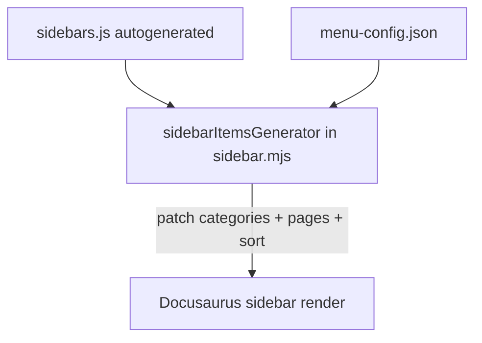

# Consolidate sidebar config into `menu-config.json`

## Goal

Today, sidebar metadata is split across two places:

1. **16 `_category_.json` files** — section labels, order, collapse
2. **Doc frontmatter** — `sidebar_position` / `sidebar_label` on individual pages (3 files today)

**After:** one file, `menu-config.json`, controls **all** sidebar ordering and labeling for dev docs. No `_category_.json` files, no `sidebar_position` or `sidebar_label` in doc frontmatter.

**Out of scope:** community sidebar (`website/community/`), frozen `versioned_sidebars/` for 0.7/0.8 releases.

---

## Approach: `sidebarItemsGenerator` overlay

1. Calls `defaultSidebarItemsGenerator` (filesystem discovery unchanged — new docs still appear automatically)
2. Walks the returned tree recursively
3. Applies `menu-config.json` to each `category` node (by directory path) and each `doc` node (by doc id)
4. Sorts siblings by `position` at each level



No prebuild script or generated files in `docs/`.

---

## `menu-config.json` schema

Two top-level maps:

```json
{
  "categories": {
    "getting-started": {
      "label": "Getting Started",
      "position": 1,
      "collapsed": false
    },
    "well-lit-paths/foundations": {
      "label": "Foundations",
      "position": 1
    }
  },
  "pages": {
    "getting-started/quickstart": {
      "position": 1
    },
    "getting-started/accelerators": {
      "position": 2
    },
    "contributing": {
      "position": 99
    }
  }
}
```

### `categories` — keyed by full path relative to `docs/` (any nesting depth)

Category keys use **slash-separated paths** from the `docs/` root. Nesting works at every level — there is no special top-level-only rule:

| Key in `menu-config.json` | Actual folder |
|---------------------------|---------------|
| `how-to-guides` | `docs/how-to-guides/` (top-level sibling of `getting-started`, **not** under it) |
| `well-lit-paths/foundations` | `docs/well-lit-paths/foundations/` |
| `architecture/core/router` | `docs/architecture/core/router/` |
| `infrastructure/providers/aks` | `docs/infrastructure/providers/aks/` |

**Note:** `how-to-guides` is already a **top-level** section (position 3), not `getting-started/how-to-guides/`.

| Field | Type | Purpose |
|-------|------|---------|
| `label` | string | Sidebar section heading |
| `position` | number | Order among siblings **at that nesting level** |
| `collapsed` | boolean | Default expand/collapse |
| `collapsible` | boolean | Optional — disable collapsing |
| `className` | string | Optional CSS class |
| `link` | object | Optional category index override |

**Populate every folder that becomes a sidebar category** — not only the 16 that had `_category_.json` today. Folders with multiple docs or subfolders become categories; each gets an explicit entry so labels and order are never left to Docusaurus auto-naming (e.g. `"Aks"` instead of `"AKS"`).

#### Top-level categories (from existing `_category_.json`)

| Path | label | position | collapsed |
|------|-------|----------|-----------|
| `getting-started` | Getting Started | 1 | false |
| `well-lit-paths` | Well-Lit Paths | 2 | true |
| `how-to-guides` | How-to Guides | 3 | true |
| `architecture` | Concepts (Architecture) | 4 | true |
| `operations` | Operations & Monitoring | 5 | true |
| `infrastructure` | Infrastructure & Environments | 6 | true |
| `api-reference` | References | 7 | true |

#### Nested categories (existing `_category_.json`)

| Path | label | position |
|------|-------|----------|
| `well-lit-paths/foundations` | Foundations | 1 |
| `well-lit-paths/workloads` | Workloads | 2 |
| `architecture/core` | Core | 1 |
| `architecture/core/router/epp` | EPP | — |
| `architecture/advanced` | Capabilities | 2 |
| `architecture/advanced/kv-management` | KV Cache Management | — |
| `infrastructure/gateway` | Gateways | — |
| `infrastructure/providers` | Infrastructure Providers | — |
| `infrastructure/rdma` | RDMA | — |

#### Nested categories (new entries — no `_category_.json` today, need explicit labels)

These folders already appear in the sidebar but currently get auto-generated labels from folder names. Add them to `menu-config.json` for clarity:

| Path | Suggested label | Notes |
|------|-----------------|-------|
| `architecture/core/router` | Router | from README H1 |
| `architecture/advanced/autoscaling` | Autoscaling | |
| `architecture/advanced/batch` | Batch Inference | |
| `architecture/advanced/disaggregation` | Disaggregated Serving | |
| `operations/observability` | Observability | |
| `operations/rollouts` | Rollout Guides | |
| `well-lit-paths/workloads/batch-serving` | Batch Serving | |
| `infrastructure/providers/aks` | AKS | |
| `infrastructure/providers/gke` | GKE | |
| `infrastructure/providers/digitalocean` | DigitalOcean | |
| `infrastructure/providers/digitalocean/gpu-configs` | GPU Configs | |
| `infrastructure/providers/digitalocean/monitoring` | Monitoring | |
| `infrastructure/providers/minikube` | minikube | |
| `infrastructure/providers/openshift` | OpenShift | |
| `infrastructure/providers/openshift-aws` | OpenShift on AWS | |

Positions for nested siblings can be added where order matters (e.g. provider folders under `infrastructure/providers/`); unpositioned siblings sort alphabetically.

Categories without a `menu-config.json` entry still render (auto-discovered) but use Docusaurus defaults — avoid this for any folder that should have a human-readable label.

### `pages` — keyed by doc id (path under `docs/` without extension)

| Field | Type | Purpose |
|-------|------|---------|
| `position` | number | Order within parent folder |
| `label` | string | Sidebar label override (replaces `sidebar_label`) |

**Migrate from existing frontmatter:**

| Doc id | position | label |
|--------|----------|-------|
| `getting-started/quickstart` | 1 | — |
| `getting-started/accelerators` | 2 | — |
| `contributing` | 99 | — |

Pages **not** listed in `pages` still appear (auto-discovered) and sort alphabetically among siblings with no position. Add entries to `menu-config.json` whenever explicit order or labels are needed — this is the only place to configure them.

---

## Implementation

### 1. Create `scripts/lib/sidebar.mjs`

Core logic:

- **`loadMenuConfig(path)`** — read/parse `menu-config.json`; fail fast on invalid JSON
- **`categoryDir(item)`** — infer docs-relative directory from a category node
- **`applyMenuConfig(items, config)`** — recursive walk:
  - `type: 'category'`: merge `config.categories[dir]` (`label`, `collapsed`, etc.)
  - `type: 'doc'`: merge `config.pages[item.id]` (`label`, `position` applied at sort time)
  - Recurse into `item.items`
  - **`sortSiblings(items, config, parentDir)`** — sort by `position` ascending; unpositioned items after positioned ones, then alphabetical
- **`makeSidebarItemsGenerator(menuConfig)`** — async wrapper around `defaultSidebarItemsGenerator`
- **`validateMenuConfig(config, docsDir)`**:
  - Warn on orphan `categories` / `pages` keys (no matching dir/doc)
  - Warn on `pages` keys pointing to missing files
  - Warn on category-eligible directories missing from `categories` (dirs with 2+ docs or any subdirs, excluding `assets/`)

### 2. Wire into `docusaurus.config.js`

```js
import { makeSidebarItemsGenerator, loadMenuConfig } from './scripts/lib/sidebar.mjs';

const menuConfig = loadMenuConfig(path.join(siteDir, 'menu-config.json'));
```

Add to preset classic `docs` block:

```js
sidebarItemsGenerator: makeSidebarItemsGenerator(menuConfig),
```

Community plugin keeps its own generator (filter `contribute`).

### 3. Create `menu-config.json`

- **~31 category entries** — all 16 migrated from `_category_.json` plus ~15 nested dirs that lacked config (see tables above)
- **3 page entries** — migrated from frontmatter

Optional helper: a one-time `node scripts/extract-menu-config.mjs` script can scan `docs/` for category-eligible directories and emit a skeleton `menu-config.json` (labels from README H1s), then hand-tune positions. Not required if entries are authored directly.

### 4. Delete all `_category_.json` files

Remove all 16 files under `docs/**/_category_.json`.

### 5. Strip sidebar frontmatter from docs

Remove `sidebar_position` and `sidebar_label` from:

- `docs/getting-started/quickstart.md`
- `docs/getting-started/accelerators.md`
- `docs/contributing.md`

No other docs currently use these fields. Add a note in contributing guide that sidebar metadata must not be added to frontmatter.

### 6. Update documentation

- `sidebars.js` — point at `menu-config.json` + `sidebar.mjs`
- `docs/contributing.md`:
  - Remove `_category_.json` and `sidebar_position` / `sidebar_label` instructions
  - Document `menu-config.json` `categories` and `pages` sections
- `README.md` — add `menu-config.json` to layout

### 7. Validation

- `validateMenuConfig` warns at config load time
- Optional `npm run validate:menu` script in `package.json`

---

## Implementation checklist

- [x] Create `menu-config.json` with all category-eligible dirs (nested paths) and pages
- [x] Implement `scripts/lib/sidebar.mjs` (apply categories + pages, sort, validate)
- [x] Wire `sidebarItemsGenerator` into `docusaurus.config.js` docs preset
- [x] Delete all 16 `docs/**/_category_.json` files
- [x] Remove `sidebar_position` / `sidebar_label` from doc frontmatter
- [x] Update `sidebars.js`, `contributing.md`, `README.md`

---

## Versioning note

Released versions (0.7, 0.8) use frozen `versioned_sidebars/*.json` and are unaffected. `npm run version:cut` snapshots the current sidebar tree (with menu-config applied) into the new frozen sidebar JSON.

---

## Verification

```bash
cd website
npm run build
npm start
```

Confirm:

- Top-level order unchanged: Getting Started → Well-Lit Paths → How-to Guides → Architecture → Operations → Infrastructure → References
- `getting-started/quickstart` before `getting-started/accelerators`
- `contributing` appears last in its section
- No `_category_.json` files remain; no `sidebar_position` in doc frontmatter
